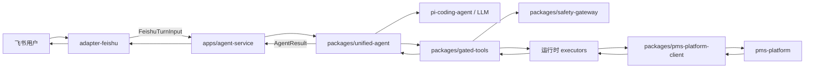
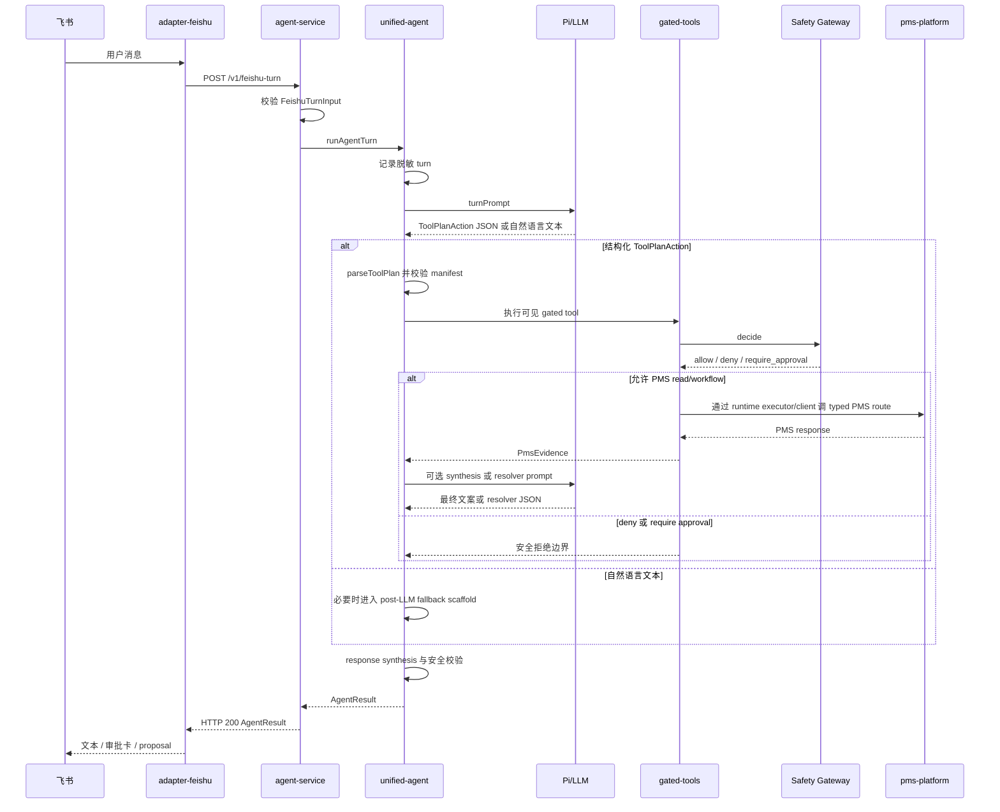
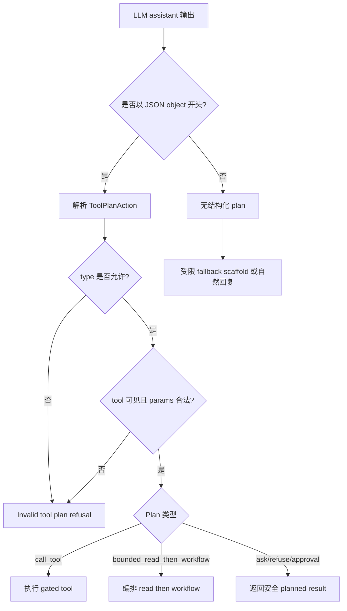
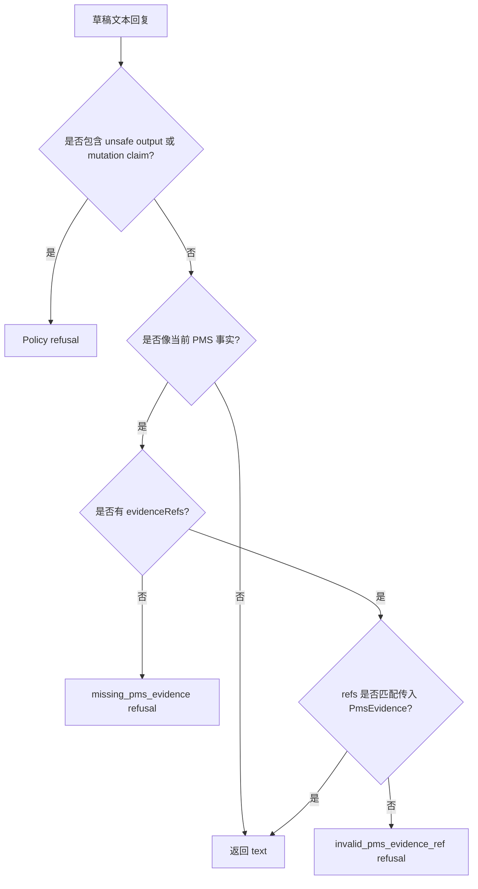
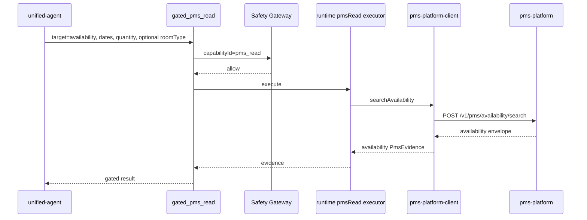
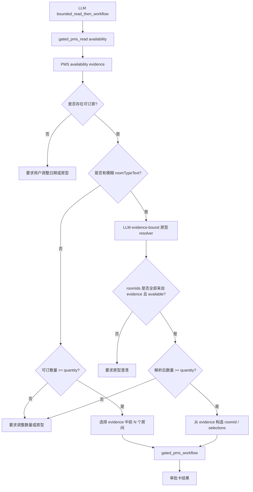
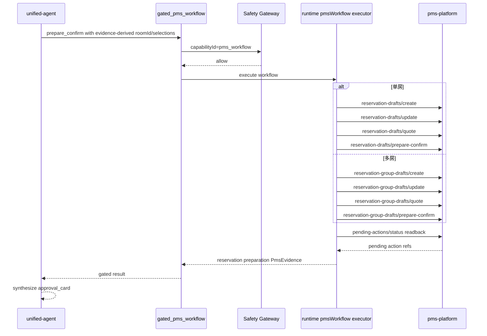
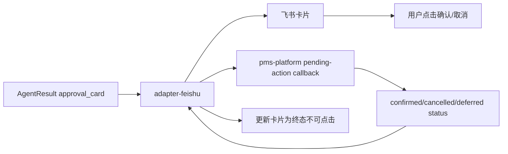

# PMS Agent V2 对话架构

状态：当前架构说明  
范围：`pms-agent-v2` 对话与运行时机制  
最后复核：2026-05-08

## 1. 目标

本文档说明 `pms-agent-v2` 如何处理飞书对话轮次、规划 PMS 动作、读取权威 PMS 事实、准备审批卡，并保护最终回复。

当前运行链路是：

```text
adapter-feishu -> pms-agent-v2/apps/agent-service -> pms-platform
```

核心顺序是：

```text
LLM 观察/规划 -> typed ToolPlanAction -> runtime 校验 -> Safety Gateway -> PMS evidence/workflow -> response synthesis
```

Agent 可以理解用户语言并提出动作计划，但不拥有 PMS 事实、不拥有权限决策，也不拥有最终 PMS 变更权。

## 2. 系统拓扑



| 层 | 主要代码 | 负责 | 不能负责 |
| --- | --- | --- | --- |
| 飞书传输 | 外部仓库 `adapter-feishu` | 飞书事件、消息、卡片、callback 转发 | PMS 事实、LLM 规划 |
| 服务边界 | `apps/agent-service` | HTTP 路由、鉴权、会话缓存、运行时装配 | 策略逻辑、PMS 业务事实 |
| Agent 运行时 | `packages/unified-agent` | Prompt、Pi 会话、ToolPlan 解析、对话编排 | 原始 executor、PMS 最终变更权 |
| Gated tools | `packages/gated-tools` | gated request envelope、decision/executor 执行顺序 | 策略语义 |
| Safety Gateway | `packages/safety-gateway` | capability allow/deny/approval 决策、脱敏审计摘要 | PMS 事实、副作用执行 |
| PMS client | `packages/pms-platform-client` | typed HTTP 调用、响应校验、`PmsEvidence<T>` | prompt 记忆、最终用户文案 |
| PMS Platform | 外部仓库 `pms-platform` | 当前 PMS 事实、草稿、pending-action 状态 | 飞书传输、LLM runtime |

## 3. 单轮对话生命周期

`apps/agent-service` 暴露：

```text
GET  /health
POST /v1/feishu-turn
POST /v1/eval-turn
```

每一轮对话的处理步骤：

1. service 校验 `FeishuTurnInput`。
2. service 根据 channel、tenant、session、profile 获取或创建缓存的 `UnifiedAgentSession`。
3. `runAgentTurn(...)` 记录脱敏连续性状态。
4. Pi/LLM 会话收到包含 policy、continuity、advisory context、可见 gated tools、严格 ToolPlan 形状的 prompt。
5. assistant 输出会被解释为结构化 JSON plan 或自然语言文本。
6. 结构化 plan 经过 runtime 校验后，才可进入 gated tools。
7. 最终输出必须经过 response synthesis 校验后才能成为 `AgentResult`。



## 4. LLM-First 规划契约

运行时是 LLM-first，但不是 LLM-authoritative。

对于可执行对话，LLM 必须选择一个 JSON action：

```ts
type ToolPlanAction =
  | { type: "call_tool"; toolName: string; params: Record<string, unknown> }
  | { type: "bounded_read_then_workflow"; read: BoundedToolStep; workflow: BoundedToolStep }
  | { type: "ask_clarification"; message: string }
  | { type: "refuse"; reason: "policy" | "unsupported" | "invalid_request"; message: string }
  | { type: "require_approval"; message: string };
```

runtime 校验保证：

- 只能调用当前 profile 可见的 gated tools。
- `bash`、`read`、`write`、`edit`、`http`、`http_request` 等 raw tools 会被拒绝。
- `gated_pms_read` 接受 typed PMS read 参数，例如日期、数量、客人姓名、可选房型。
- 直接 `gated_pms_workflow` 不能自行执行多房 workflow。
- `bounded_read_then_workflow` 是唯一可以从新鲜 PMS evidence 派生 room selections 的路径。



## 5. PMS Evidence Law

当前 PMS 事实只在来自 `pms-platform` evidence 时才是权威事实。

以下事实必须有当前 `PmsEvidence` 支撑：

- 可订数量
- 房型可订状态
- 价格
- 房态
- 预订状态
- pending-action 状态
- 库存/订单状态

以下来源不能回答当前 PMS 事实：

- session continuity
- workspace 文件
- skills/persona 文本
- model prior knowledge
- 飞书用户原始说法
- memory summary

`packages/pms-platform-client` 会把 typed platform 响应封装为：

```ts
type PmsEvidence<T> = {
  evidenceRef: string;
  source: { system: "pms-platform"; method: string };
  scope: { tenantId: string };
  fetchedAt: string;
  summary: string;
  data: T;
};
```

response synthesis 会拒绝没有当前 evidence refs 的 PMS fact-like 文本。



## 6. 可订查询路径

可订查询是低风险 PMS 事实读取，但仍必须经过 Safety Gateway。



如果最终回复报告可订事实，必须包含该次查询返回的 evidence ref。

## 7. Bounded Read Then Workflow

预订准备是两步受限 plan：

```text
gated_pms_read -> PMS availability evidence -> runtime candidate selection -> gated_pms_workflow
```

这个设计用于防止 LLM 编造 roomId。



### 模糊房型解析

对于 `洞穴房`、`别墅房` 这类用户口语表达，runtime 不应把原文直接作为 PMS Platform 精确查询条件。

正确流程：

1. LLM plan 把用户原话保留为 `roomTypeText`。
2. runtime 先执行 broad PMS availability read。
3. runtime 再提示 LLM 只能基于 PMS 返回候选解析 `roomTypeText`。
4. runtime 校验每一个被选中的 `roomId` 是否来自当前 evidence。
5. 只有校验通过的候选可以成为 workflow 的 `roomId` 或 `selections[]`。

resolver 输出保持很小：

```json
{ "ok": true, "roomType": "秘境洞穴", "roomIds": ["room-D1", "room-D2"] }
```

或者：

```json
{ "ok": false, "message": "我查到花园别墅和秘境洞穴，请确认你说的洞穴房是否指秘境洞穴。" }
```

LLM 可以解释语言，但 runtime 必须拒绝任何不在当前 PMS evidence 中的 ID 和房型。

## 8. PMS Workflow 路径

`gated_pms_workflow` 用于准备 reservation draft evidence 和审批卡。它不会创建最终 reservation。

当前 runtime 行为：

- `quantity <= 1` 走单房 draft routes。
- `quantity > 1` 走 group draft routes。
- 两条路径都会准备 typed pending action。
- 生成的审批卡只确认 pending-action/draft 状态；最终创建正式预订仍是未来 PMS Platform 能力。



## 9. 审批卡与 Callback 语义

审批卡由 `adapter-feishu` 投递，但 PMS pending-action 真相仍在 `pms-platform`。



关键语义：

- 自然语言 `确认` 不是 PMS 审批。
- 按钮点击才是 typed approval boundary。
- 当前 confirm 表示 pending-action/draft confirmation，最终 mutation 仍是 deferred。
- adapter 负责卡片 UI 状态和 callback transport。
- PMS Platform 负责 pending-action 状态和审计。
- Agent 不应声称“最终订房成功”，除非 PMS Platform 后续提供已创建 reservation 的 evidence。

## 10. 普通聊天与 Fallback

对于问候和普通对话，Agent 应使用用户语言自然回复，并简要说明可以提供的 PMS 帮助。

正常路径仍然是 LLM-first：

```text
用户问候 -> LLM prompt -> 自然 assistant text -> response synthesis -> text AgentResult
```

如果 LLM 没有返回可用文本，或对可执行 PMS turn 没有返回结构化 plan，runtime 可以使用受限 fallback scaffold：

- customer PMS fallback：简单可订查询/prepare-confirm 场景。
- admin proposal fallback：proposal workspace 场景。
- natural greeting fallback：简单问候。

fallback 是降级安全脚手架，不是主要智能路径。

### Policy-echo 失败模式

已观察到的失败形态：

```text
User: 你好
Assistant: Current PMS facts require pms-platform evidence refs.
```

这表示 LLM 没有回答问候，而是复读了 policy/context 文本。response synthesis 随后把这句 policy-looking 文本当作 current PMS fact-like 输出，并返回 missing-evidence refusal。

正确修复方向是增加 policy-echo guard：普通聊天如果只收到内部 policy/evidence-law 文本，应丢弃该文本并使用 natural greeting fallback，而不是把 policy 句子发给用户。

## 11. 脱敏运行观测

设置 `PMS_AGENT_LOG_TURN_EVENTS=true` 后会输出脱敏 turn events：

```text
pms_agent_turn_planned
pms_agent_tool_result
pms_agent_turn_result
```

这些事件必须保持脱敏：

- 不包含原始用户文本
- 不包含原始 PMS payload
- 不包含 evidence refs
- 不包含 pending-action IDs
- 不包含 secrets 或 credentials

它们用于定位单轮对话停在什么阶段：

- no structured plan
- invalid tool plan
- gated tool result
- response synthesis
- final AgentResult delivery

`adapter-feishu` 也会记录脱敏 forwarding events，例如 inbound summary、turn forwarding status、delivery success/failure、callback dispatch。

## 12. Runtime 决策矩阵

| 用户意图 | 必要路径 | 用户可见结果 |
| --- | --- | --- |
| 问候 / 普通聊天 | LLM 自然回复，必要时 fallback | `text` |
| 房态/可订查询 | `gated_pms_read` -> PMS evidence | 带 `evidenceRefs` 的 `text` |
| 信息完整的预订准备 | bounded read then workflow | `approval_card` |
| 模糊房型预订 | broad PMS read -> LLM evidence-bound resolver -> workflow | `approval_card` 或澄清 |
| 缺日期 / 客人 / 房型 | LLM 澄清 | reason 为 `invalid_request` 的用户问题 |
| 自然语言确认 | 不执行 PMS mutation | 安全拒绝 / 要求卡片审批 |
| 卡片按钮确认/取消 | adapter callback -> pms-platform pending action | 卡片终态更新 / 状态反馈 |
| Admin proposal | gated proposal tools | `proposal` 或 approval-required result |

## 13. 开发守则

未来修改对话机制时必须保持这些不变量：

1. 保持 LLM-first 的理解和规划路径。
2. 保持 Safety Gateway 作为唯一执行边界。
3. 保持 PMS facts 必须由当前 `PmsEvidence` 支撑。
4. 保持 roomId 和 selections 只能来自 PMS evidence。
5. 保持自然语言 mutation 被阻断。
6. 保持飞书传输层不拥有 PMS 业务事实。
7. 优先使用小型 typed contracts，而不是通用 workflow framework。
8. 同时为成功路径、拒绝路径和澄清路径补测试。

重要 runtime 变更建议验证：

```bash
pnpm build && pnpm test
```

